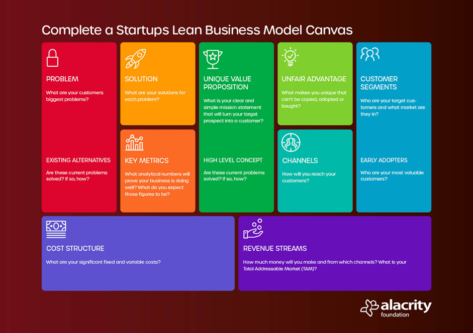

# Inleveropdracht: Lean Canvas App

**In deze groepsopdracht maken jullie een webapplicatie waarin men een Lean Business Model Canvas kan invullen. De applicatie is ‘client-side’: er is geen interactie met een server, alles wordt in de browser van de gebruiker uitgevoerd.**

In de applicatie moeten de negen onderdelen van het Lean Canvas worden getoond. Voor elk onderdeel (bijvoorbeeld _Probleem_) moet de gebruiker items aan dat onderdeel kunnen toevoegen of bestaande items kunnen verwijderen. Uiteindelijk moet het ingevulde Canvas bewaard kunnen worden door het te exporteren naar een JSON-bestand. Zo’n JSON-bestand moet ook weer geïmporteerd kunnen worden zodat een gebruiker verder kan gaan met het bewerken van het Canvas.





Bron: [Alacrity Foundation](https://alacrityfoundation.co.uk/a-startups-lean-business-model-canvas/)

# Voorbeeld

Een voorbeelduitwerking vind je hieronder:


# Functionaliteit

De Lean Canvas App moet de onderstaande **functionaliteit** bevatten:

### (1) Openen van een leeg Canvas

Als de applicatie geopend wordt, dient er een leeg Canvas getoond te worden die dezelfde layout / blokken-indeling heeft als een 'echt' Lean Canvas. Elk blok heeft een titel, een omschrijving en een icoon (zie voor het laatste de formattering).

De `state` die hiervoor nodig is, is al gegeven in `Canvas.jsx`.


### (2) Inlezen van een Canvas via JSON

Via een 'Importeer bestaand Canvas' knop moet de gebruiker van de applicatie een JSON-bestand kunnen uploaden. Let erop dat er geen andere bestandsformaten geupload mogen worden.
Als de gebruiker een JSON-bestand heeft geupload, moet dit bestand ingelezen worden en moet het ingelezen Canvas getoond worden. 

Je vindt hieronder voorbeeldcode om van een `<input type="file">` element het eerste bestand op te halen en deze in te lezen in de variabele genaamd `json`.

```
...
  const bestand = event.target.files[0];
  event.target.value = null;
  
  const fileReader = new FileReader();
  fileReader.readAsText(bestand, "UTF-8");
  fileReader.onload = (e) => {
    const json = JSON.parse(e.target.result)
  
    // Vul hier aan
  };
...
```

### (3) Bullet points toevoegen per onderdeel van het Canvas

Per onderdeel van het Canvas (zoals _Probleem_ en _Oplossing_) dient de gebruiker bullet points toe te kunnen voegen. Hiertoe dient er een knop te zijn om een nieuwe bullet toe te voegen die vervolgens een popup toont. In de popup kan de gebruiker de tekst van de bullet ingeven in een groot tekstvak. Zorg ervoor dat er automatisch gefocust wordt op het tekstvak bij het openen van de popup, zodat de gebruiker gelijk kan beginnen met typen. Valideer de input van de gebruiker: als er niets wordt ingegeven moet het niet mogelijk zijn om het bullet point toe te voegen. De popup moet ook weer gesloten kunnen worden met een kruisje, voor het geval dat de gebruiker de bullet niet meer wil toevoegen.


### (4) Bullet points verwijderen per onderdeel van het Canvas

Als er eenmaal bullet points zijn toegevoegd aan een onderdeel, moeten deze ook verwijderd kunnen worden met een Verwijder- / 'x'-knop. Bij het klikken op die knop moet de bullet direct verwijderd worden.

### (5) Exporteren van het ingevulde Canvas

Nadat het Canvas is ingevuld, dient de gebruiker deze te kunnen exporteren door middel van een 'Exporteer Canvas' knop. Het Canvas dient dan gedownload te worden als een `json`-bestand, met als bestandsnaam 'Canvas' en de huidige datum en tijd.

Code die van een object een json-bestand maakt is al gegeven in `helper.jsx`.


# Opmaak/Mark-up

Buiten de opmaak/mark-up die je toevoegt voor de hierboven beschreven functionaliteit, moet de Lean Canvas App ook de onderstaande **opmaak/mark-up** bevatten:

* Er dient een `header` element te zijn met een titel en de knoppen om een Canvas te importeren en exporteren.
* Er dient een `main` element te zijn met de inhoud van het Canvas (zie de hierboven beschreven functionaliteit).


# Formattering

De Lean Canvas App moet de onderstaande **formattering** bevatten:

* De webapplicatie dient voorzien te zijn van een achtergrondkleur.
* De layout van het Canvas dient behouden te blijven: verschillende rijen met verschillende kolommen en in sommige kolommen nog een splitsing tussen twee blokken / onderdelen.
* Pas marges en padding toe op de kolommen, de onderdelen in het Canvas en de bullets.
* De blokken / onderdelen van het Canvas dienen voorzien te zijn van een icoon en  dienen elk een aparte achtergrondkleur te hebben.
* Die achtergrondkleur dient ook gebruikt te worden in de popup(s) behorend bij dat specifieke onderdeel.
* De knop om een bullet toe te voegen (bonus: en presentatiemodus te openen) aan een onderdeel dient enkel getoond te worden als de gebruiker met de muis over dat specifieke onderdeel van het Canvas gaat.
* Elke bullet is voorzien van een achtergrondkleur die verandert als er met de muis over de bullet wordt gegaan.
* De knop om een bullet te verwijderen enkel getoond te worden als de gebruiker met de muis over die specifieke bullet gaat.
* De popups die getoond worden dienen voorzien te zijn van een vergelijkbare formattering als de onderdelen van het Canvas (kleur en lettertype).
* Bij het openen van de popup dient er een 'backdrop' te zijn: de popup is op de voorgrond zichtbaar, en het Canvas op de achtergrond is uitgevaagd.
* Voor de acties 'Importeer', 'Exporteer' en 'Voeg toe' (bonus: en 'Presentatiemodus') dienen gepaste iconen gebruikt te worden. Je kunt hiervoor gebruik maken van [FontAwesome](https://fontawesome.com/).

# Bonus

### Bonus #1: Controle op verwijderen

Je kunt bonuspunten verdienen door een extra controle in te bouwen bij het verwijderen. Als men op de Verwijder-knop klikt toon je nu eerst een 'Weet je zeker dat je [tekst] wil verwijderen?' popup. In de popup staan twee opties: 'Verwijderen' en 'Annuleren' en is er ook een kruisje om de popup te sluiten. Bij het klikken op 'Verwijderen' dient de bullet verwijderd te worden, bij klikken op 'Annuleren' dient de popup te sluiten.


### Bonus #2: Presentatiemodus: uitlichten specifiek onderdeel

Tijdens het BE11-college krijg je een casus en dien je op basis van die casus een Lean Canvas in te vullen. In BE12 gebruik je je Lean Canvas App om deze presentatie te doen. 

Je kunt bonuspunten verdienen door een presentatiemodus te implementeren. De gebruiker moet daartoe een onderdeel uit het Canvas als popup kunnen openen. In de popup is de formattering anders dan in het 'normale' Canvas: de tekst is groter, zodat je de bullets goed kunt lezen als je een presentatie geeft. De popup dient ook weer gesloten te kunnen worden.


# Beoordeling

Je wordt beoordeeld op de volgende elementen:

* Zoals hierboven omschreven:
  * Opmaak/mark-up
  * Functionaliteit
  * Formattering
* Structuur van je code (o.a. het (her)gebruik van componenten, losse CSS-bestanden, slim gebruik van shorthands)
* Commentaar dat je bijvoegt in je code (denk aan toelichtingen bij methods en ingewikkelde operaties)

Bonus: Je beoordeling kan **niet boven het maximum van 100 punten uitkomen**, maar je kunt dus wel eventuele tekortkomingen in andere stukken compenseren.